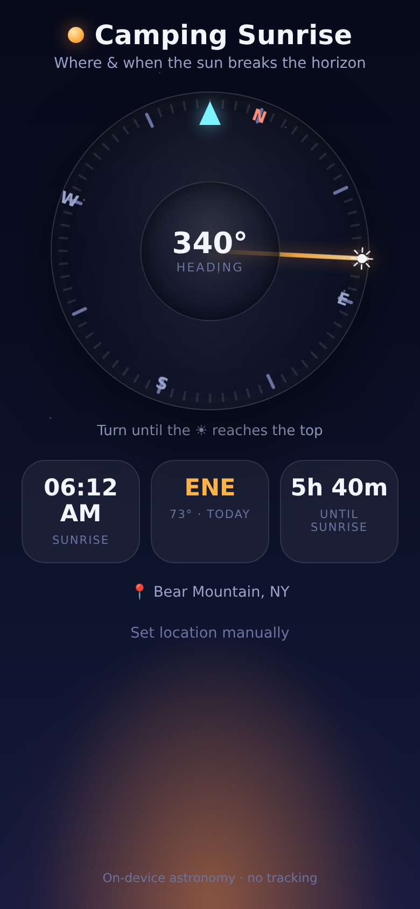

# 🌅 Camping Sunrise

**Point your phone and find exactly where — and when — the sun will rise tomorrow morning.**

A clean, modern mobile web app for campers. Using your phone's **GPS** and
**compass**, it shows the upcoming sunrise's **time**, the **compass bearing**
where the sun will break the horizon, and a live compass that guides you to
face that exact spot — so you can pitch your tent, set your camera, or just
know where to look before dawn.

Everything runs **on‑device**. No servers, no tracking, and it works fully
offline once loaded — perfect for a campsite with no signal.



## Features

- 📍 **Automatic location** via GPS (with manual lat/lon entry as a fallback).
- 🧭 **Live compass** using the phone's magnetometer — turn until the ☀ marker
  reaches the top and you're facing the sunrise.
- ⏰ **Next sunrise time** and a live **countdown**.
- ➡️ **Sunrise bearing** shown both as a compass point (e.g. *ENE*) and exact
  degrees.
- ❄️ Handles **polar day / polar night** gracefully (midnight sun, or the sun
  staying below the horizon).
- 📲 **Installable PWA** — add it to your home screen; works offline.
- 🔒 **Private** — all astronomy is computed locally; nothing leaves the phone.

## Running it

Sensors (GPS + compass) are only available in a **secure context**, so serve
it over `https://` or `localhost`:

```bash
npm start          # → http://localhost:8080
```

Then open it on your phone (on the same network, via your machine's LAN IP
over HTTPS, or host the static files anywhere that serves HTTPS). On iOS you'll
be asked to grant **Motion & Orientation** access — that's the compass.

> The app is a set of static files (`index.html`, `css/`, `js/`, icons,
> `manifest.webmanifest`, `sw.js`). You can drop them on any static host —
> GitHub Pages, Netlify, etc. No build step.

## How it works

- **`js/solar.js`** — dependency-free astronomy. Computes sunrise/sunset/solar
  noon and the sun's azimuth using the well-established algorithm popularised by
  SunCalc. Accuracy is ~1 minute for time and a fraction of a degree for
  bearing — far finer than a phone compass can resolve. `nextSunrise()` returns
  the next upcoming sunrise plus its compass bearing.
- **`js/app.js`** — wires GPS + `DeviceOrientation` (handling the iOS
  `webkitCompassHeading` and Android absolute-orientation differences) into the
  live compass UI, and rotates the dial so the phone's heading is at the top.

## Tests

```bash
npm test         # unit tests: verifies the solar math against known NOAA data
npm run test:e2e # drives the real app in headless Chromium (Playwright)
npm run test:all # both
```

The unit suite checks sunrise times against reference values for New York,
London and Sydney across solstices and equinoxes, verifies sunrise bearings
(due‑east at the equinox, north‑of‑east in northern summer, etc.), and covers
polar day/night. The e2e suite loads the app in a mobile‑sized Chromium,
feeds it a location and simulated compass input, and asserts the readouts
render and the dial reacts — with zero runtime errors.

## License

MIT
